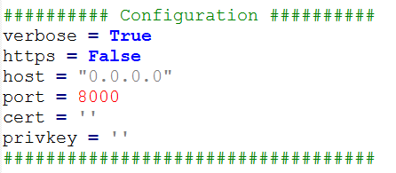
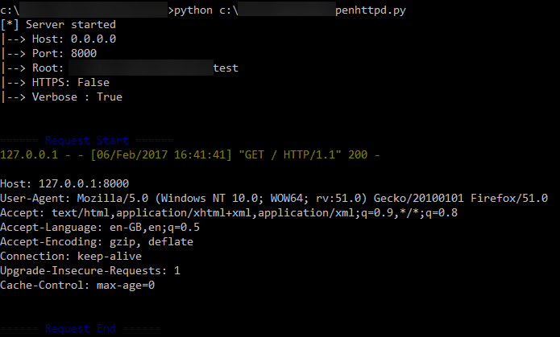
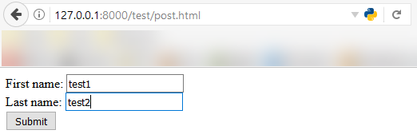
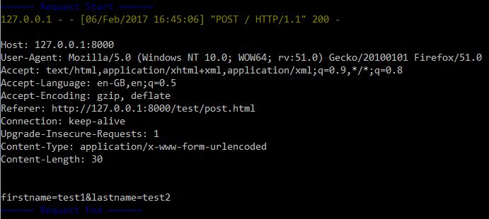
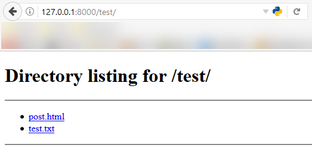

# penhttpd
## Description
Python based standalone HTTP/HTTPS server for penetration testers.     

The server aims to provide a mean for pentesters to serve files within their current working directory, just as python's SimpleHTTPServer does. Additionally, penhttpd supports SSL wrapping, and provides a verbose option to review the content of requests received by the server. So far, the tool has been tested on Linux and Windows.

## Features
* HTTPS support
* Verbose option to display the requests' content. (Useful for OOB exfiltration)
* Option to specify the web root
* Automatic generation of SSL certificates

## Requirements
- Python 2.7/3.6 (earlier versions may work, but have not been tested yet)
- [openssl](https://www.openssl.org/)
- colorama (optional). To install it, run the following command:
```
pip install colorama.
```

## Documentation
### Arguments
- --host: Listening host
- --port: Listening port
- --ssl: Use SSL wrapping
- --cert: Specify the path to the server's certificate
- --key: Specify the path to the private key
- -v, --verbose: Verbose mode, prints out the content of the requests received by the server.
- -w, --wd: Specify working directory.

### Examples
```
./penhttpd.py
./penhttpd.py --ssl
./penhttpd.py -w /tmp --host 127.0.0.1 --port 443 --ssl
./penhttpd.py --ssl --cert cert.pem --key key.pem
```

### Persistent configuration
It possible to run the server without any argument. To do so, just edit the config section at the beginning of the source code, as shown below.



## Screenshots





## Known Issues
### SSLError: [SSL: TLSV1_ALERT_UNKNOWN_CA] tlsv1 alert unknown ca
The TLv1 unknown CA alert is sent by some clients if they cannot verify the certificate of the server because it is signed by an unknown issuer CA. Consequently, this will raise an error in penhttpd. This exception will not prevent the server from functioning as expected after the certificate has been accepted by the client.

A solution would be to catch this instance when the request is processed, but it would require a substantial effort to refactor the code. This should be addressed in the next version.

*Note to myself: to do so, use `handle_request` to handle each request by itself and catch exceptions instead of using `serve_forever`.*

## TODO
- [ ] Use OS temp folder to store temporary certificates.
- [ ] Do a better readme that doesn't suck as much as this one...
